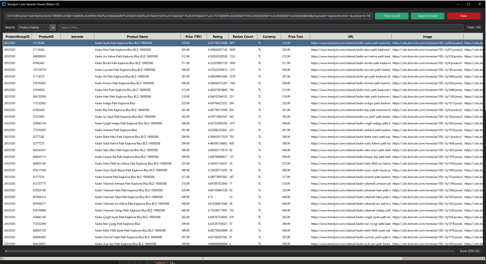

# Trendyol Color Variants Viewer (Metro UI)

**Author:** Ebubekir Bastama  
**License:** MIT  
**Language:** Python 3  
**UI Framework:** [CustomTkinter](https://github.com/TomSchimansky/CustomTkinter)

---

## 🖼️ Program Screenshot


---


## Overview

**Trendyol Color Variants Viewer** is a modern Python GUI application for fetching, listing, and exporting product variant data from **Trendyol’s public API**.

It features a clean **Metro-style dark interface**, **data grid display**, **search**, and **Excel export** — all without needing a browser.

The program automatically connects to the Trendyol API, retrieves JSON data for multiple product group IDs, and displays the results in an interactive grid.

---

## Features

- Metro-style interface built with CustomTkinter  
- Search bar for filtering by product name, ProductID, or barcode  
- Automatic API fetch from any Trendyol `color-variants` URL  
- Data grid view using `ttk.Treeview`  
- Export to Excel (`.xlsx`) with one click  
- Clear list and reset with confirmation dialog  
- Progress bar and real-time status updates  
- Duplicate protection – prevents re-downloading same ProductIDs  
- Compatible with Trendyol API headers and cookie structure  

---

## Requirements

Make sure Python 3.10+ is installed, then run:

```bash
pip install customtkinter pandas requests openpyxl
```

---

## Usage

1. Clone this repository:
   ```bash
   git clone https://github.com/ebubekirbastama/trendyol-color-variants-viewer.git
   cd trendyol-color-variants-viewer
   ```

2. Run the app:
   ```bash
   python trendyol_color_variants_viewer.py
   ```

3. Paste any valid Trendyol API endpoint, for example:
   ```
   https://apigw.trendyol.com/discovery-sfint-search-service/api/
   ```

4. Click **Fetch & Add** — products will appear in the grid.

5. Use the **Search** box (by name, ProductID, or barcode) to filter.

6. Click **Export to Excel** to save all listed data to `urunler.xlsx`.

---

## API Notes

Trendyol requires realistic request headers to avoid HTTP 400 or 403 errors.
This program automatically sets the following headers:

```http
User-Agent: Mozilla/5.0 (Windows NT 10.0; Win64; x64)
Accept-Language: tr-TR,tr;q=0.9,en-US;q=0.8,en;q=0.7
Origin: https://www.trendyol.com
Referer: https://www.trendyol.com/
x-request-source: single-search-result
```

You may add your own cookies (e.g., `AbTestingCookies`, `storefrontId`, etc.) inside the `cookies` dictionary in the `_fetch_thread` method.

---

## File Structure

```
trendyol-color-variants-viewer/
├── trendyol_color_variants_viewer.py
├── README.txt
└── urunler.xlsx          # Generated output file (after export)
```

---

## Credits

Developed by **Ebubekir Bastama**  
GitHub: [@ebubekirbastama](https://github.com/ebubekirbastama)

If you like this project, please ⭐ the repository!

---

## License

This project is released under the MIT License.
